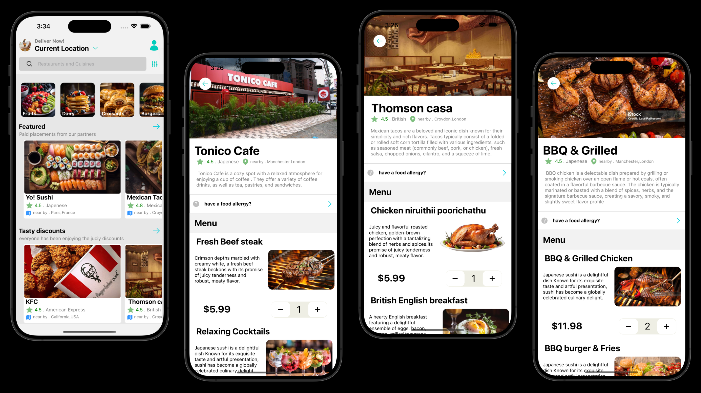
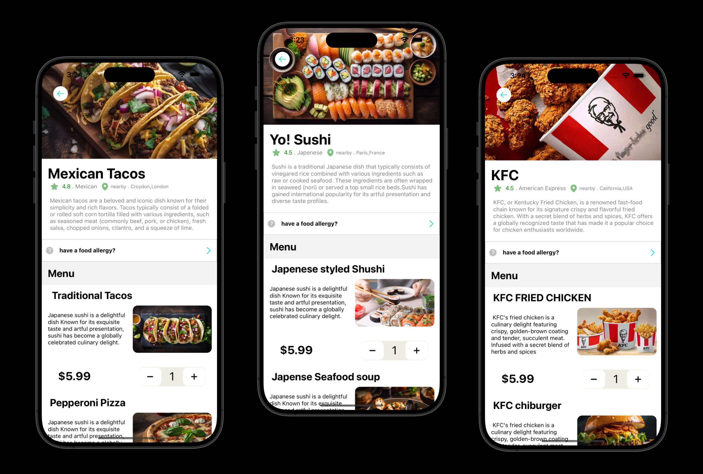
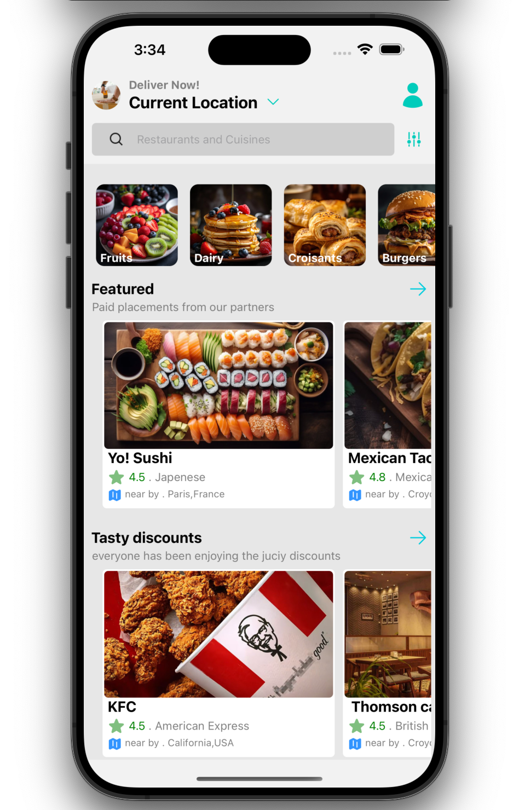
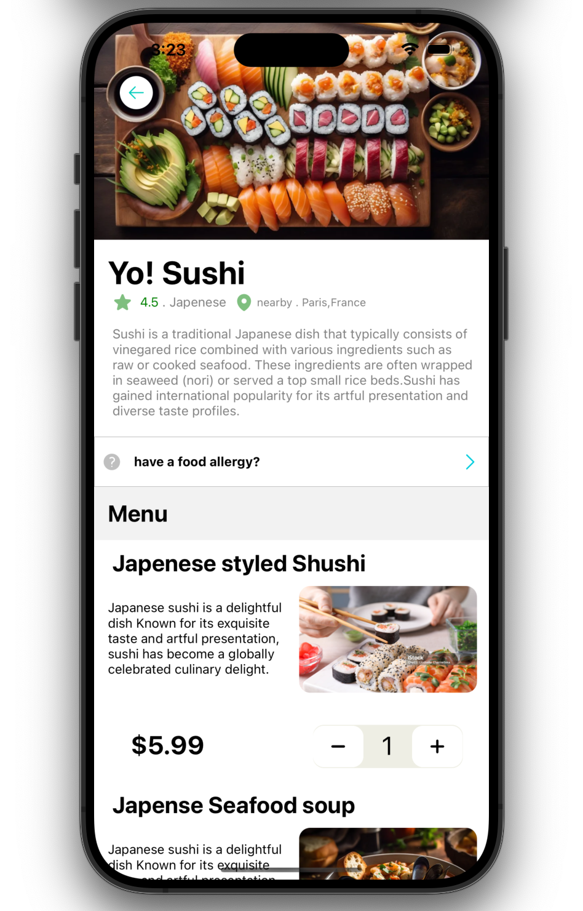
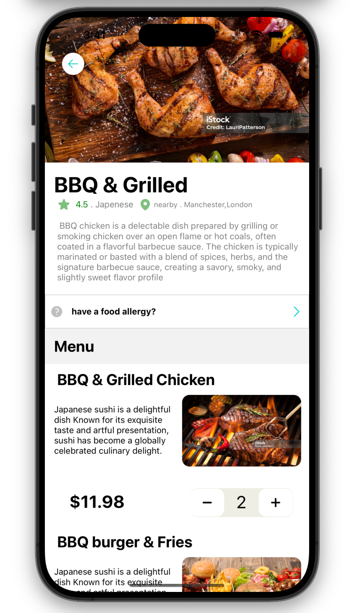
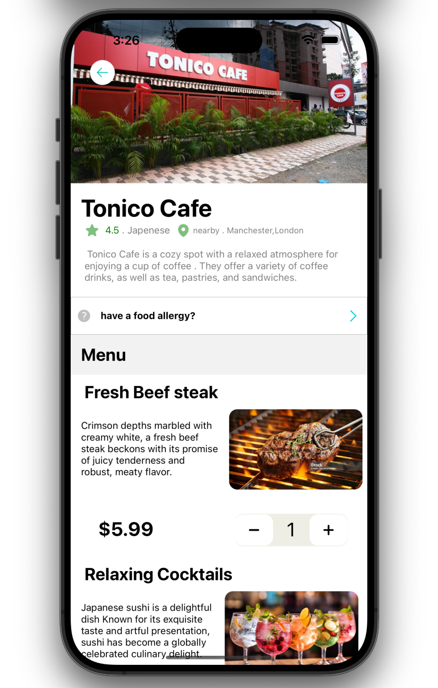
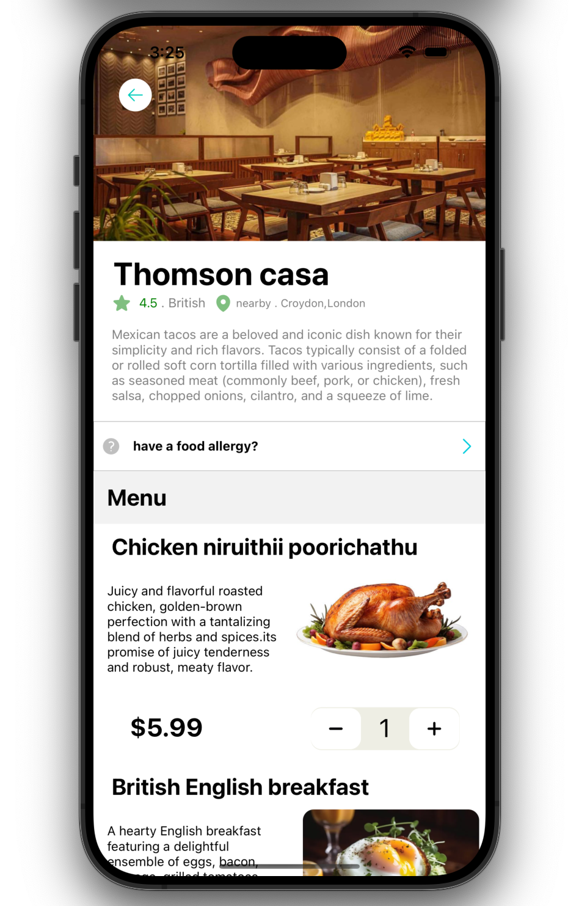

# DELIVEROO -CLONE UI

A Deliveroo clone is a platform designed to replicate the functionality and features of the popular food delivery service, Deliveroo. This type of application typically connects customers with local restaurants and facilitates the ordering and delivery of food. 

## Overview

## Screenshots

## 🔗 Links

